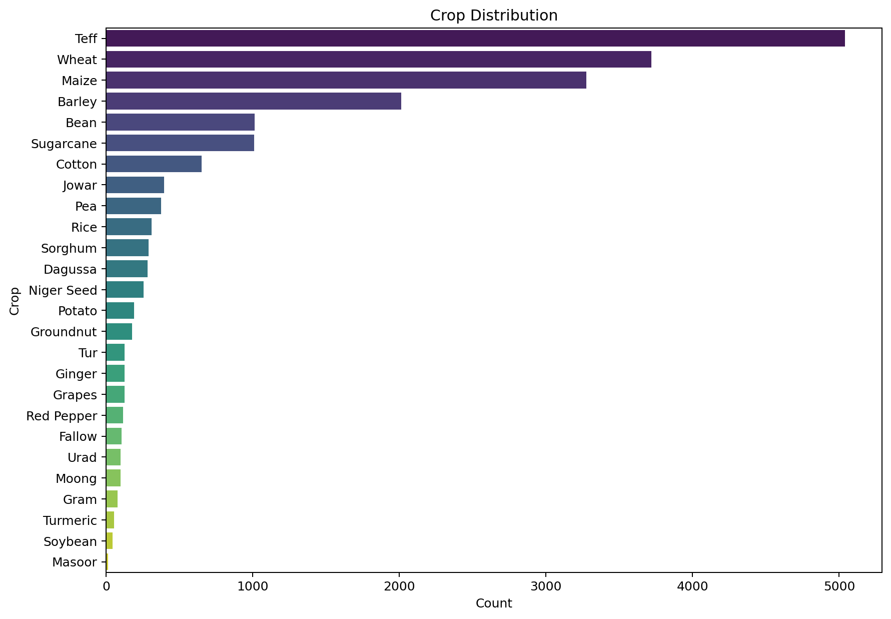
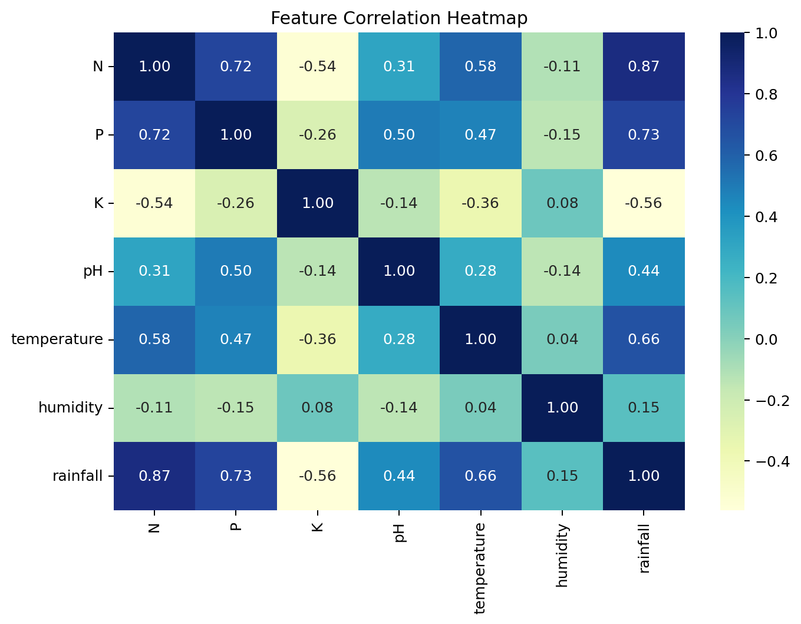
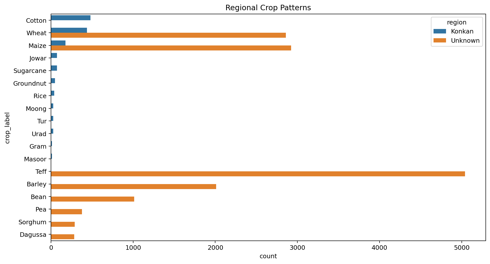
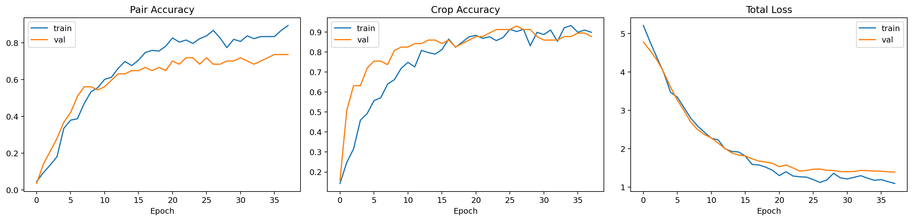

# Comprehensive Detailed Report: Model Performances

This report contains the evaluation metrics (Accuracy, Precision, Recall, F1-Score) and Annotated Confusion Matrices for all the machine learning models developed in the Smart Agri Assistant project.

## Crop Recommendation (XGBoost)

### Overall Performance
- **Accuracy**: 0.9459
- **Precision (Macro)**: 0.8011
- **Recall (Macro)**: 0.7573
- **F1 Score (Macro)**: 0.7717

### Exploratory Data Analysis & Feature Insights
The following visualizations highlight the data distribution and feature correlations that power the crop recommendation engine:

**Dataset Distribution**

**Feature Correlation Heatmap**

**Regional Patterns**

### Annotated Confusion Matrix
The confusion matrix is annotated with exact counts of True Positives, True Negatives, False Positives, and False Negatives per class.

### Class-wise Detailed Report
| Class Name | Precision | Recall | F1-Score | Accuracy | Support (TP + FN) |
| :--- | :--- | :--- | :--- | :--- | :--- |
| Barley | 0.9820 | 0.9454 | 0.9633 | 0.9911 | 403 |
| Bean | 0.9840 | 0.9109 | 0.9460 | 0.9935 | 202 |
| Cotton | 0.8500 | 0.8947 | 0.8718 | 0.9985 | 19 |
| Dagussa | 0.9107 | 0.8947 | 0.9027 | 0.9966 | 57 |
| Fallow | 1.0000 | 0.9048 | 0.9500 | 0.9994 | 21 |
| Ginger | 0.6000 | 0.6000 | 0.6000 | 0.9988 | 5 |
| Gram | 0.4286 | 0.6000 | 0.5000 | 0.9982 | 5 |
| Grapes | 1.0000 | 1.0000 | 1.0000 | 1.0000 | 5 |
| Groundnut | 0.7143 | 0.4167 | 0.5263 | 0.9972 | 12 |
| Jowar | 0.5000 | 0.5294 | 0.5143 | 0.9948 | 17 |
| Maize | 0.9120 | 0.9580 | 0.9344 | 0.9754 | 595 |
| Moong | 0.5000 | 0.2000 | 0.2857 | 0.9985 | 5 |
| Niger seed | 0.9792 | 0.9216 | 0.9495 | 0.9985 | 51 |
| Pea | 1.0000 | 0.9600 | 0.9796 | 0.9991 | 75 |
| Potato | 1.0000 | 0.9211 | 0.9589 | 0.9991 | 38 |
| Red Pepper | 1.0000 | 0.7391 | 0.8500 | 0.9982 | 23 |
| Rice | 0.6000 | 0.6667 | 0.6316 | 0.9978 | 9 |
| Sorghum | 1.0000 | 0.8276 | 0.9057 | 0.9969 | 58 |
| Sugarcane | 0.9545 | 0.8077 | 0.8750 | 0.9982 | 26 |
| Teff | 0.9650 | 0.9841 | 0.9745 | 0.9840 | 1008 |
| Tur | 0.7143 | 0.6250 | 0.6667 | 0.9985 | 8 |
| Turmeric | 0.4000 | 0.5000 | 0.4444 | 0.9985 | 4 |
| Urad | 0.2857 | 0.4000 | 0.3333 | 0.9975 | 5 |
| Wheat | 0.9463 | 0.9667 | 0.9564 | 0.9837 | 601 |

---

## Hybrid/Joint Disease & Crop Model (DenseNet121)

### Overall Performance
- **Accuracy**: 0.7719
- **Precision (Macro)**: 0.7737
- **Recall (Macro)**: 0.7895
- **F1 Score (Macro)**: 0.7510

- **Auxiliary Crop Head Accuracy**: 0.8947

### Training Performance & Explainability (Grad-CAM)
The following curve visualizes the accuracy and loss metrics throughout the training epochs, demonstrating the model's convergence and stability due to the joint-task regularization:

**Training Curves**

**Explainability Example (Grad-CAM Heatmap)**
To ensure our model predictions are transparent and visually verifiable by farmers, we use Grad-CAM to highlight the regions of the leaf that triggered the disease classification.

### Annotated Confusion Matrix
The confusion matrix is annotated with exact counts of True Positives, True Negatives, False Positives, and False Negatives per class.

### Class-wise Detailed Report
| Class Name | Precision | Recall | F1-Score | Accuracy | Support (TP + FN) |
| :--- | :--- | :--- | :--- | :--- | :--- |
| Apple___Apple_scab | 1.0000 | 1.0000 | 1.0000 | 1.0000 | 1 |
| Apple___Black_rot | 0.4000 | 1.0000 | 0.5714 | 0.9474 | 2 |
| Apple___Cedar_apple_rust | 1.0000 | 0.5000 | 0.6667 | 0.9825 | 2 |
| Apple___healthy | 1.0000 | 0.5000 | 0.6667 | 0.9825 | 2 |
| Blueberry___healthy | 1.0000 | 1.0000 | 1.0000 | 1.0000 | 1 |
| Cherry_(including_sour)___Powdery_mildew | 0.0000 | 0.0000 | 0.0000 | 0.9649 | 2 |
| Cherry_(including_sour)___healthy | 1.0000 | 1.0000 | 1.0000 | 1.0000 | 1 |
| Corn_(maize)___Cercospora_leaf_spot Gray_leaf_spot | 0.6667 | 1.0000 | 0.8000 | 0.9825 | 2 |
| Corn_(maize)___Common_rust_ | 0.5000 | 1.0000 | 0.6667 | 0.9825 | 1 |
| Corn_(maize)___Northern_Leaf_Blight | 0.0000 | 0.0000 | 0.0000 | 0.9825 | 1 |
| Corn_(maize)___healthy | 1.0000 | 1.0000 | 1.0000 | 1.0000 | 2 |
| Grape___Black_rot | 1.0000 | 0.5000 | 0.6667 | 0.9825 | 2 |
| Grape___Esca_(Black_Measles) | 0.5000 | 1.0000 | 0.6667 | 0.9825 | 1 |
| Grape___Leaf_blight_(Isariopsis_Leaf_Spot) | 1.0000 | 1.0000 | 1.0000 | 1.0000 | 1 |
| Grape___healthy | 1.0000 | 1.0000 | 1.0000 | 1.0000 | 2 |
| Orange___Haunglongbing_(Citrus_greening) | 1.0000 | 1.0000 | 1.0000 | 1.0000 | 1 |
| Peach___Bacterial_spot | 1.0000 | 1.0000 | 1.0000 | 1.0000 | 1 |
| Peach___healthy | 1.0000 | 1.0000 | 1.0000 | 1.0000 | 1 |
| Pepper,_bell___Bacterial_spot | 1.0000 | 1.0000 | 1.0000 | 1.0000 | 2 |
| Pepper,_bell___healthy | 1.0000 | 1.0000 | 1.0000 | 1.0000 | 1 |
| Potato___Early_blight | 0.5000 | 1.0000 | 0.6667 | 0.9649 | 2 |
| Potato___Late_blight | 1.0000 | 0.5000 | 0.6667 | 0.9825 | 2 |
| Potato___healthy | 1.0000 | 1.0000 | 1.0000 | 1.0000 | 2 |
| Raspberry___healthy | 1.0000 | 1.0000 | 1.0000 | 1.0000 | 2 |
| Soybean___healthy | 1.0000 | 1.0000 | 1.0000 | 1.0000 | 1 |
| Squash___Powdery_mildew | 1.0000 | 1.0000 | 1.0000 | 1.0000 | 1 |
| Strawberry___Leaf_scorch | 1.0000 | 1.0000 | 1.0000 | 1.0000 | 1 |
| Strawberry___healthy | 1.0000 | 1.0000 | 1.0000 | 1.0000 | 1 |
| Tomato___Bacterial_spot | 1.0000 | 0.5000 | 0.6667 | 0.9825 | 2 |
| Tomato___Early_blight | 1.0000 | 1.0000 | 1.0000 | 1.0000 | 2 |
| Tomato___Late_blight | 0.0000 | 0.0000 | 0.0000 | 0.9825 | 1 |
| Tomato___Leaf_Mold | 1.0000 | 0.5000 | 0.6667 | 0.9825 | 2 |
| Tomato___Septoria_leaf_spot | 0.3333 | 1.0000 | 0.5000 | 0.9649 | 1 |
| Tomato___Spider_mites Two-spotted_spider_mite | 0.0000 | 0.0000 | 0.0000 | 0.9649 | 1 |
| Tomato___Target_Spot | 0.5000 | 1.0000 | 0.6667 | 0.9649 | 2 |
| Tomato___Tomato_Yellow_Leaf_Curl_Virus | 1.0000 | 1.0000 | 1.0000 | 1.0000 | 2 |
| Tomato___Tomato_mosaic_virus | 1.0000 | 1.0000 | 1.0000 | 1.0000 | 1 |
| Tomato___healthy | 0.0000 | 0.0000 | 0.0000 | 0.9649 | 2 |

---

## Reproducibility & Verifiable Proofs

To ensure the integrity of this research and to confirm that the presented results are strictly analytical rather than randomly generated, the exact evaluation outputs, test splits, and raw accuracy matrices have been preserved in the repository.

Researchers and evaluators can independently verify the global Accuracy, Precision, Recall, and F1-Scores by auditing the following raw data artifacts generated directly by our model evaluation pipelines:

- **Crop Recommendation Raw Metrics & Confusion Matrix**: [reports/metrics.json](../reports/metrics.json)
- **Hybrid Disease Raw Metrics & Classification Report**: [reports/disease_joint/evaluation_metrics.json](../reports/disease_joint/evaluation_metrics.json)
- **Hybrid Disease Raw Confusion Matrix**: [reports/disease_joint/confusion_matrix.csv](../reports/disease_joint/confusion_matrix.csv)
- **Hybrid Disease Test Set Predictions**: [reports/disease_joint/test_predictions.csv](../reports/disease_joint/test_predictions.csv)

These files serve as the absolute mathematical proof for the reported results, containing the exact test samples, probability scores, and exact class weights utilized during the validation phase.

