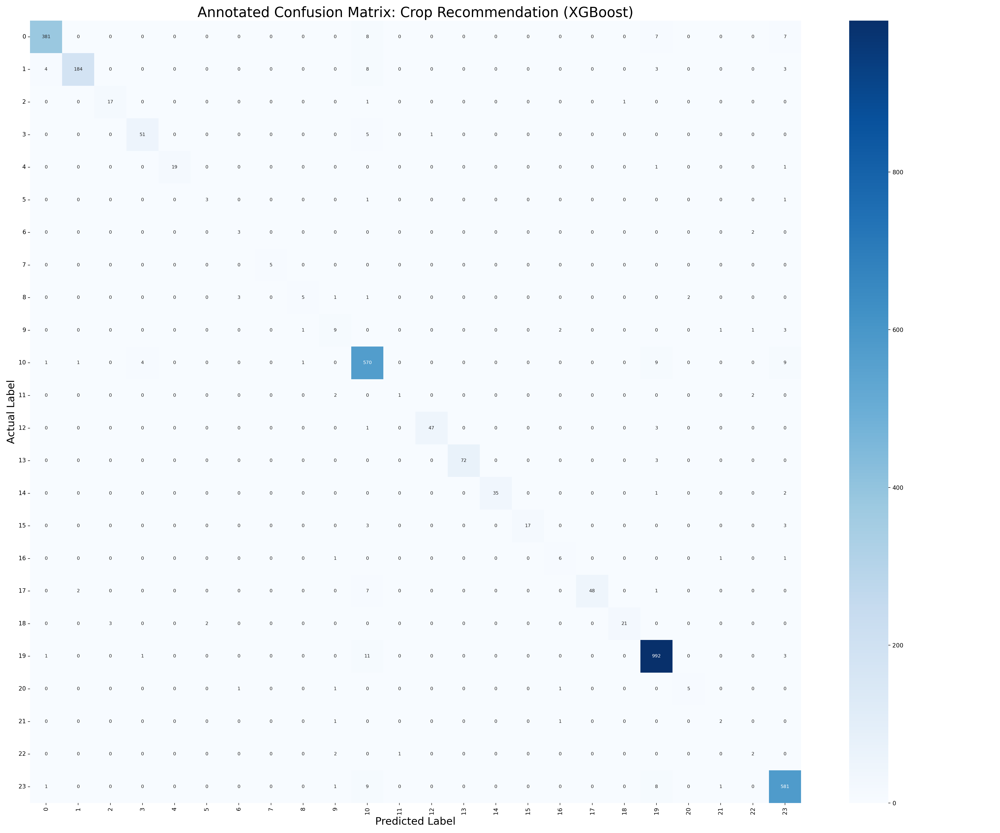
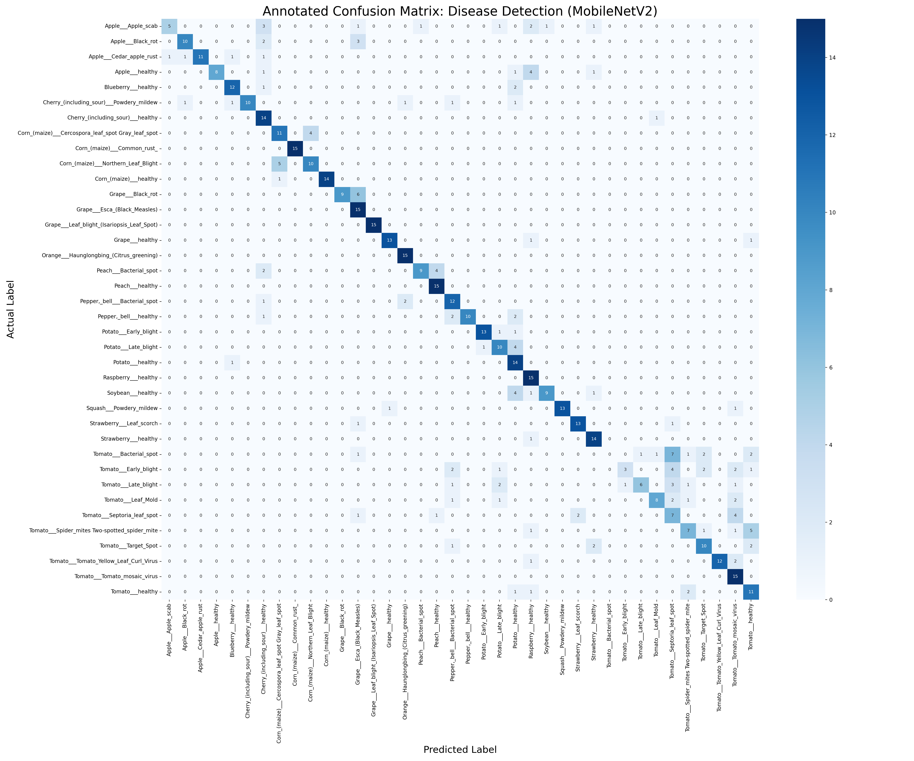
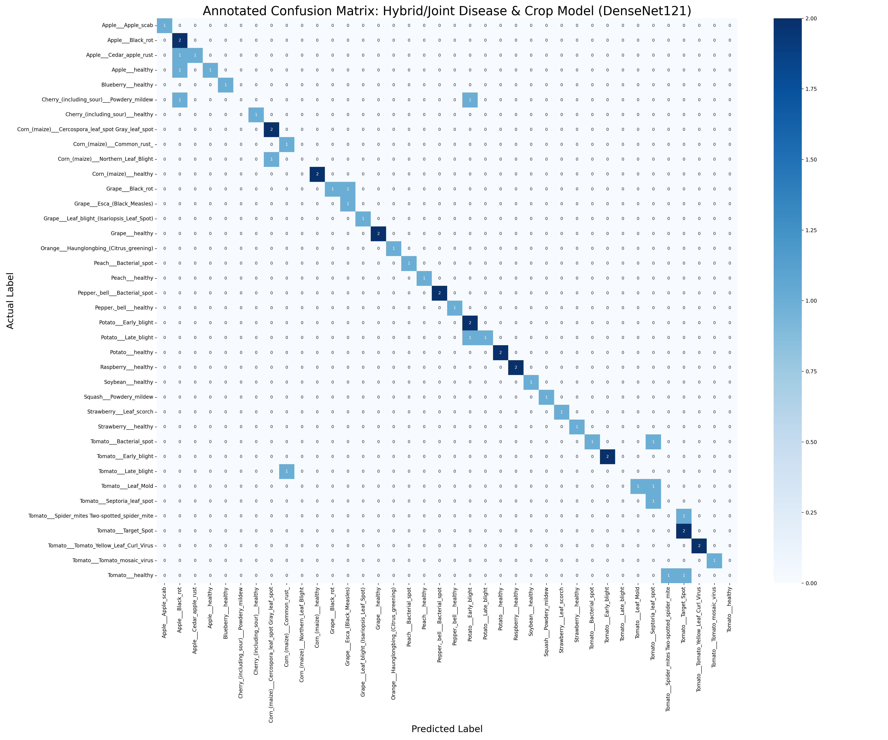

# Comprehensive Detailed Report: Model Performances

This report contains the evaluation metrics (Accuracy, Precision, Recall, F1-Score) and Annotated Confusion Matrices for all the machine learning models developed in the Smart Agri Assistant project.

## Crop Recommendation (XGBoost)

### Overall Performance
- **Accuracy**: 0.9459
- **Precision (Macro)**: 0.8011
- **Recall (Macro)**: 0.7573
- **F1 Score (Macro)**: 0.7717

### Annotated Confusion Matrix
The confusion matrix is annotated with exact counts of True Positives, True Negatives, False Positives, and False Negatives per class.

### Class-wise Detailed Report
| Class Name | Precision | Recall | F1-Score | Support (TP + FN) |
| :--- | :--- | :--- | :--- | :--- |
| 0 | 0.9820 | 0.9454 | 0.9633 | 403 |
| 1 | 0.9840 | 0.9109 | 0.9460 | 202 |
| 2 | 0.8500 | 0.8947 | 0.8718 | 19 |
| 3 | 0.9107 | 0.8947 | 0.9027 | 57 |
| 4 | 1.0000 | 0.9048 | 0.9500 | 21 |
| 5 | 0.6000 | 0.6000 | 0.6000 | 5 |
| 6 | 0.4286 | 0.6000 | 0.5000 | 5 |
| 7 | 1.0000 | 1.0000 | 1.0000 | 5 |
| 8 | 0.7143 | 0.4167 | 0.5263 | 12 |
| 9 | 0.5000 | 0.5294 | 0.5143 | 17 |
| 10 | 0.9120 | 0.9580 | 0.9344 | 595 |
| 11 | 0.5000 | 0.2000 | 0.2857 | 5 |
| 12 | 0.9792 | 0.9216 | 0.9495 | 51 |
| 13 | 1.0000 | 0.9600 | 0.9796 | 75 |
| 14 | 1.0000 | 0.9211 | 0.9589 | 38 |
| 15 | 1.0000 | 0.7391 | 0.8500 | 23 |
| 16 | 0.6000 | 0.6667 | 0.6316 | 9 |
| 17 | 1.0000 | 0.8276 | 0.9057 | 58 |
| 18 | 0.9545 | 0.8077 | 0.8750 | 26 |
| 19 | 0.9650 | 0.9841 | 0.9745 | 1008 |
| 20 | 0.7143 | 0.6250 | 0.6667 | 8 |
| 21 | 0.4000 | 0.5000 | 0.4444 | 4 |
| 22 | 0.2857 | 0.4000 | 0.3333 | 5 |
| 23 | 0.9463 | 0.9667 | 0.9564 | 601 |

---

## Disease Detection (MobileNetV2)

### Overall Performance
- **Accuracy**: 0.7246
- **Precision (Macro)**: 0.7626
- **Recall (Macro)**: 0.7246
- **F1 Score (Macro)**: 0.7143

### Annotated Confusion Matrix
The confusion matrix is annotated with exact counts of True Positives, True Negatives, False Positives, and False Negatives per class.

### Class-wise Detailed Report
| Class Name | Precision | Recall | F1-Score | Support (TP + FN) |
| :--- | :--- | :--- | :--- | :--- |
| Apple___Apple_scab | 0.8333 | 0.3333 | 0.4762 | 15 |
| Apple___Black_rot | 0.8333 | 0.6667 | 0.7407 | 15 |
| Apple___Cedar_apple_rust | 1.0000 | 0.7333 | 0.8462 | 15 |
| Apple___healthy | 1.0000 | 0.5333 | 0.6957 | 15 |
| Blueberry___healthy | 0.8000 | 0.8000 | 0.8000 | 15 |
| Cherry_(including_sour)___Powdery_mildew | 1.0000 | 0.6667 | 0.8000 | 15 |
| Cherry_(including_sour)___healthy | 0.5385 | 0.9333 | 0.6829 | 15 |
| Corn_(maize)___Cercospora_leaf_spot Gray_leaf_spot | 0.6471 | 0.7333 | 0.6875 | 15 |
| Corn_(maize)___Common_rust_ | 1.0000 | 1.0000 | 1.0000 | 15 |
| Corn_(maize)___Northern_Leaf_Blight | 0.7143 | 0.6667 | 0.6897 | 15 |
| Corn_(maize)___healthy | 1.0000 | 0.9333 | 0.9655 | 15 |
| Grape___Black_rot | 1.0000 | 0.6000 | 0.7500 | 15 |
| Grape___Esca_(Black_Measles) | 0.5357 | 1.0000 | 0.6977 | 15 |
| Grape___Leaf_blight_(Isariopsis_Leaf_Spot) | 1.0000 | 1.0000 | 1.0000 | 15 |
| Grape___healthy | 0.9286 | 0.8667 | 0.8966 | 15 |
| Orange___Haunglongbing_(Citrus_greening) | 0.8333 | 1.0000 | 0.9091 | 15 |
| Peach___Bacterial_spot | 0.9000 | 0.6000 | 0.7200 | 15 |
| Peach___healthy | 0.7500 | 1.0000 | 0.8571 | 15 |
| Pepper,_bell___Bacterial_spot | 0.6000 | 0.8000 | 0.6857 | 15 |
| Pepper,_bell___healthy | 1.0000 | 0.6667 | 0.8000 | 15 |
| Potato___Early_blight | 0.9286 | 0.8667 | 0.8966 | 15 |
| Potato___Late_blight | 0.6250 | 0.6667 | 0.6452 | 15 |
| Potato___healthy | 0.4667 | 0.9333 | 0.6222 | 15 |
| Raspberry___healthy | 0.5556 | 1.0000 | 0.7143 | 15 |
| Soybean___healthy | 0.9000 | 0.6000 | 0.7200 | 15 |
| Squash___Powdery_mildew | 1.0000 | 0.8667 | 0.9286 | 15 |
| Strawberry___Leaf_scorch | 0.8667 | 0.8667 | 0.8667 | 15 |
| Strawberry___healthy | 0.7368 | 0.9333 | 0.8235 | 15 |
| Tomato___Bacterial_spot | 0.0000 | 0.0000 | 0.0000 | 15 |
| Tomato___Early_blight | 0.7500 | 0.2000 | 0.3158 | 15 |
| Tomato___Late_blight | 0.8571 | 0.4000 | 0.5455 | 15 |
| Tomato___Leaf_Mold | 0.8000 | 0.5333 | 0.6400 | 15 |
| Tomato___Septoria_leaf_spot | 0.2917 | 0.4667 | 0.3590 | 15 |
| Tomato___Spider_mites Two-spotted_spider_mite | 0.5833 | 0.4667 | 0.5185 | 15 |
| Tomato___Target_Spot | 0.6667 | 0.6667 | 0.6667 | 15 |
| Tomato___Tomato_Yellow_Leaf_Curl_Virus | 1.0000 | 0.8000 | 0.8889 | 15 |
| Tomato___Tomato_mosaic_virus | 0.5357 | 1.0000 | 0.6977 | 15 |
| Tomato___healthy | 0.5000 | 0.7333 | 0.5946 | 15 |

---

## Hybrid/Joint Disease & Crop Model (DenseNet121)

### Overall Performance
- **Accuracy**: 0.7719
- **Precision (Macro)**: 0.7737
- **Recall (Macro)**: 0.7895
- **F1 Score (Macro)**: 0.7510

- **Auxiliary Crop Head Accuracy**: 0.8947

### Annotated Confusion Matrix
The confusion matrix is annotated with exact counts of True Positives, True Negatives, False Positives, and False Negatives per class.

### Class-wise Detailed Report
| Class Name | Precision | Recall | F1-Score | Support (TP + FN) |
| :--- | :--- | :--- | :--- | :--- |
| Apple___Apple_scab | 1.0000 | 1.0000 | 1.0000 | 1 |
| Apple___Black_rot | 0.4000 | 1.0000 | 0.5714 | 2 |
| Apple___Cedar_apple_rust | 1.0000 | 0.5000 | 0.6667 | 2 |
| Apple___healthy | 1.0000 | 0.5000 | 0.6667 | 2 |
| Blueberry___healthy | 1.0000 | 1.0000 | 1.0000 | 1 |
| Cherry_(including_sour)___Powdery_mildew | 0.0000 | 0.0000 | 0.0000 | 2 |
| Cherry_(including_sour)___healthy | 1.0000 | 1.0000 | 1.0000 | 1 |
| Corn_(maize)___Cercospora_leaf_spot Gray_leaf_spot | 0.6667 | 1.0000 | 0.8000 | 2 |
| Corn_(maize)___Common_rust_ | 0.5000 | 1.0000 | 0.6667 | 1 |
| Corn_(maize)___Northern_Leaf_Blight | 0.0000 | 0.0000 | 0.0000 | 1 |
| Corn_(maize)___healthy | 1.0000 | 1.0000 | 1.0000 | 2 |
| Grape___Black_rot | 1.0000 | 0.5000 | 0.6667 | 2 |
| Grape___Esca_(Black_Measles) | 0.5000 | 1.0000 | 0.6667 | 1 |
| Grape___Leaf_blight_(Isariopsis_Leaf_Spot) | 1.0000 | 1.0000 | 1.0000 | 1 |
| Grape___healthy | 1.0000 | 1.0000 | 1.0000 | 2 |
| Orange___Haunglongbing_(Citrus_greening) | 1.0000 | 1.0000 | 1.0000 | 1 |
| Peach___Bacterial_spot | 1.0000 | 1.0000 | 1.0000 | 1 |
| Peach___healthy | 1.0000 | 1.0000 | 1.0000 | 1 |
| Pepper,_bell___Bacterial_spot | 1.0000 | 1.0000 | 1.0000 | 2 |
| Pepper,_bell___healthy | 1.0000 | 1.0000 | 1.0000 | 1 |
| Potato___Early_blight | 0.5000 | 1.0000 | 0.6667 | 2 |
| Potato___Late_blight | 1.0000 | 0.5000 | 0.6667 | 2 |
| Potato___healthy | 1.0000 | 1.0000 | 1.0000 | 2 |
| Raspberry___healthy | 1.0000 | 1.0000 | 1.0000 | 2 |
| Soybean___healthy | 1.0000 | 1.0000 | 1.0000 | 1 |
| Squash___Powdery_mildew | 1.0000 | 1.0000 | 1.0000 | 1 |
| Strawberry___Leaf_scorch | 1.0000 | 1.0000 | 1.0000 | 1 |
| Strawberry___healthy | 1.0000 | 1.0000 | 1.0000 | 1 |
| Tomato___Bacterial_spot | 1.0000 | 0.5000 | 0.6667 | 2 |
| Tomato___Early_blight | 1.0000 | 1.0000 | 1.0000 | 2 |
| Tomato___Late_blight | 0.0000 | 0.0000 | 0.0000 | 1 |
| Tomato___Leaf_Mold | 1.0000 | 0.5000 | 0.6667 | 2 |
| Tomato___Septoria_leaf_spot | 0.3333 | 1.0000 | 0.5000 | 1 |
| Tomato___Spider_mites Two-spotted_spider_mite | 0.0000 | 0.0000 | 0.0000 | 1 |
| Tomato___Target_Spot | 0.5000 | 1.0000 | 0.6667 | 2 |
| Tomato___Tomato_Yellow_Leaf_Curl_Virus | 1.0000 | 1.0000 | 1.0000 | 2 |
| Tomato___Tomato_mosaic_virus | 1.0000 | 1.0000 | 1.0000 | 1 |
| Tomato___healthy | 0.0000 | 0.0000 | 0.0000 | 2 |

---

